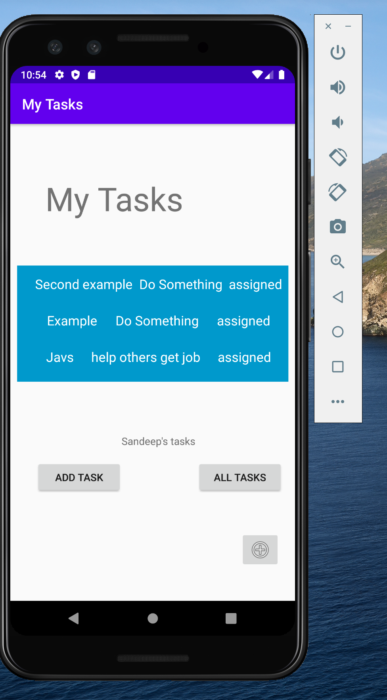
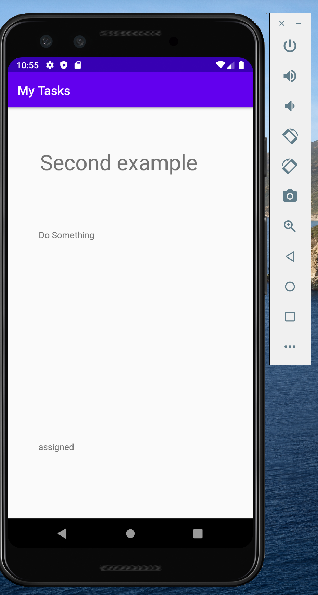

# My Tasks APP
v0.1

## How to run the app
* Clone the repository from the git hub projects
```
 git clone https://github.com/vijayetar/android_taskmaster.git
```

* Open the project using Android Studio

* The project is using Marshmallow

* Run the app using an emulator or on the android phone

## Here are images of the app 
---------------------------------
#### v0.2 
Home Screen:
*  

*   

*   

All Tasks:
*   

Add Task:  
*   

Add Test Task and print it:
*   

Show that it is submitted:
* 
------------------------------------